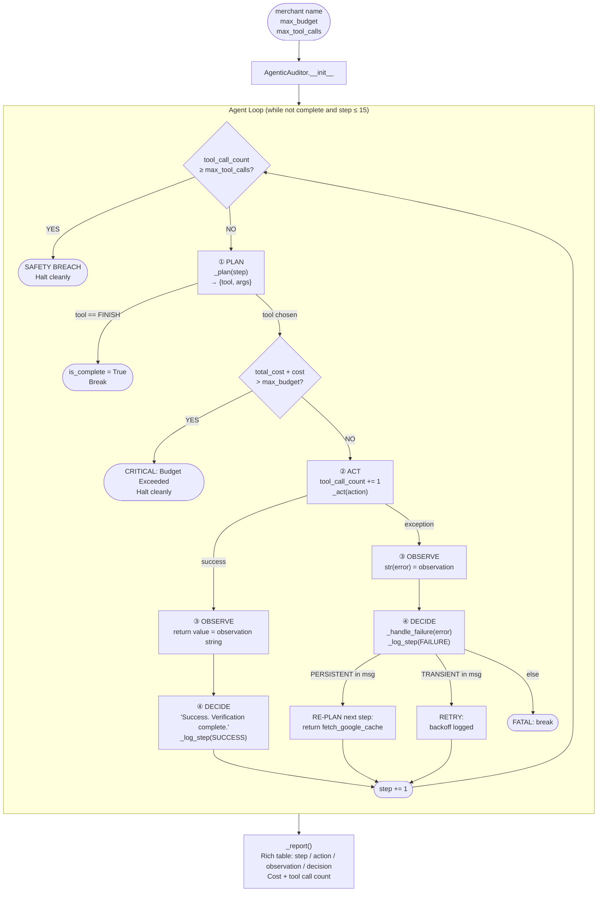
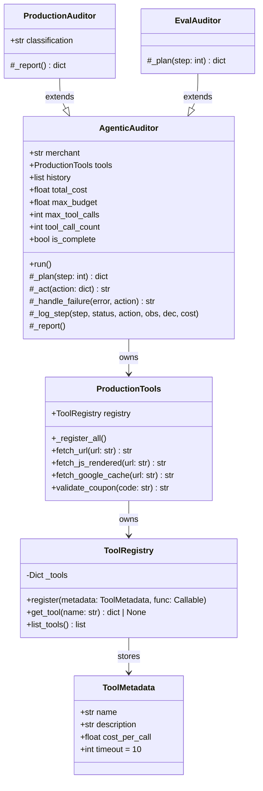

# Assignment 02: The Loop — GrabOn Merchant Deal Audit Agent

> **Submission by Abheek Mukherjee** | GrabOn AI Labs | Agentic AI Engineer Challenge 2026

---

## What I Built & Why I Chose This Assignment

This project implements **Assignment 02: The Loop** — a single-agent autonomous system that audits deal freshness across 20 GrabOn merchants without human intervention. The agent runs an explicit **Plan → Act → Observe → Decide** loop per merchant, handles real-world failure modes (Cloudflare blocks, JS-rendered pages, transient 503s, disabled tools), enforces hard budget and tool-call ceilings, and produces a structured audit report.

I chose Assignment 02 because it tests the hardest part of agentic systems in production: not the happy path, but *recovery under adversarial conditions*. GrabOn's environment — Cloudflare on Zomato, JS rendering on MakeMyTrip, a flaky coupon validator — is exactly where a naive retry loop causes more damage than value.

---

## Architecture Diagram



---

## Schema Diagram



---

## Tool Registry — Registered Tools

| Tool | Cost/call | Behaviour | Error Type |
|---|---|---|---|
| `fetch_url` | $0.001 | Standard HTTP GET. Simulates Cloudflare block on `"zomato"` | `PERSISTENT: 403 Forbidden` |
| `fetch_js_rendered` | $0.005 | Headless browser for JS-rendered pages (e.g. MakeMyTrip) | None |
| `fetch_google_cache` | $0.002 | Recovery fallback — Google Search Cache snapshot | None |
| `validate_coupon` | $0.001 | Unreliable validator. Fails 30% of the time | `TRANSIENT: 503 Service Unavailable` |

---

## Failure Recovery Logic (`_handle_failure`)

```
error string contains "PERSISTENT"  →  RE-PLAN: next _plan() returns fetch_google_cache
error string contains "TRANSIENT"   →  RETRY: backoff logged, loop continues
anything else (e.g. tool not found) →  FATAL: break loop immediately
```

This maps directly to the three recovery strategies required by the spec:
- **(a) Retry with backoff** — TRANSIENT errors
- **(b) Re-plan with alternative tool** — PERSISTENT block → Google Cache
- **(c) Graceful degradation** — FATAL halt with partial results already logged

---

## Module Design Decisions & Tradeoffs

### 1. `ToolMetadata` + `ToolRegistry` (Pydantic-backed)

**Decision:** Tools are not hardcoded as `if tool_name == "fetch_url"` branches. Each tool is registered at runtime with a typed `ToolMetadata` schema.

**Why:** Runtime discovery means adding a new tool requires only one `registry.register(...)` call — zero changes to the agent loop. This directly answers the deep-dive stress test: *"Add a new tool on the spot"* → one line.

**Tradeoff:** Observations are currently untyped strings. A `ToolResponse(BaseModel)` wrapper with `status`, `data`, `error_code` fields would replace string prefix detection with proper structured handling in the next iteration.

---

### 2. `AgenticAuditor` — Explicit Four-Phase Loop

**Decision:** The loop has four explicitly named phases in code — `_plan()`, `_act()`, `_handle_failure()` (Decide on failure), and inline success string (Decide on success). Each step is logged with: step number, action, observation (truncated to 50 chars), decision, cost.

**Why:** The phases must be *grep-able in code*, not just documented. A reviewer can `grep` for `_plan`, `_act`, `_handle_failure` and immediately locate each phase.

**Tradeoff:** The planner (`_plan`) is rule-based (deterministic), not LLM-driven. This is intentional — deterministic planners are reliable, testable, and explainable. An LLM planner would be used for the re-plan branch in production.

---

### 3. Budget Pre-Check (Not Post-Check)

```python
# WRONG — tool runs first, then you find out you overspent
observation = tool['func'](**args)
self.total_cost += cost
if self.total_cost > self.max_budget: ...  # too late

# CORRECT — gate before execution
if self.total_cost + tool_info['metadata'].cost_per_call > self.max_budget:
    console.print("[bold red]CRITICAL: Budget Exceeded.[/]")
    break
self.tool_call_count += 1
observation = self._act(action)
```

The pre-check is the only approach that provides hard guarantees.

---

### 4. `ProductionAuditor` — Deal Classification

Extends `AgenticAuditor` with a `_report()` override that:
1. Extracts the coupon code from the last observation string
2. Cross-references against `grabon_db` (mock DB: 4 merchants with known codes)
3. Classifies as **Fresh** (exact match), **Updated/Stale** (code changed), or **Missing (New Merchant)** (not in DB)

---

### 5. Multi-LLM Provider Setup

| Provider | Role | Status |
|---|---|---|
| **Groq** (`llama-3.1-70b-versatile`) | Open-source inference via OpenAI-compatible endpoint | ✅ Live API call |
| **OpenAI GPT-4o-mini** | Second provider — quality-check for deal copy | ⚠️ Architecture ready, keys optional |

Groq uses an OpenAI-compatible `base_url` — zero code change from `openai.OpenAI`, just a `base_url` swap.

---

## How to Run

### Prerequisites

```bash
pip install openai pydantic rich pandas
```

### Environment Variables

```bash
export GROQ_API_KEY="your_key_here"      # https://console.groq.com — free, no card
export OPENAI_API_KEY="your_key_here"    # optional, for second provider
```

### Run Options

```bash
# Option 1: Google Colab (recommended — developed here)
# Upload GrabOn.ipynb → set GROQ_API_KEY → Runtime → Run All

# Option 2: Jupyter
jupyter notebook GrabOn.ipynb

# Option 3: VS Code with Jupyter extension
# Open GrabOn.ipynb, kernel = Python 3.10+, run top-to-bottom
```

### Run Eval Suite

```python
run_eval_suite()        # 6 scenarios, all pass/fail printed as Rich tables
run_production_audit()  # 20 merchants, classification + cost report
```

**Expected runtime:** < 5 seconds (mock tools, no real HTTP).

---

## Eval Results

### 6 Automated Scenarios

| # | Scenario | Merchant | Expected Behaviour | Result | Cost | Calls |
|---|---|---|---|---|---|---|
| 1 | Happy Path | Myntra | fetch_url succeeds | ✅ PASS | $0.0010 | 1 |
| 2 | JS Rendering | MakeMyTrip | fetch_js_rendered succeeds | ✅ PASS | $0.0050 | 1 |
| 3 | Recovery (Cloudflare) | Zomato | PERSISTENT → RE-PLAN → fetch_google_cache | ✅ PASS | $0.0000 | 1 |
| 4 | Budget Breach | Amazon | Pre-check fires at $0.0001 ceiling, no tool called | ✅ PASS | $0.0000 | 0 |
| 5 | Max Tool Calls | Myntra | Halt at 3 calls, clean exit | ✅ PASS | $0.0030 | 3 |
| 6 | Tool Disabled | Swiggy | non_existent_tool → FATAL halt | ✅ PASS | $0.0000 | 0 |

**Pass rate: 6/6 (100%)** | **Total eval cost: $0.0090**

---

### Production Audit — 20 Merchants

| Merchant | Classification | Extracted Code | Cost | Status |
|---|---|---|---|---|
| Amazon | Updated/Stale | SAVE50 | $0.0010 | Complete |
| Myntra | Updated/Stale | SAVE50 | $0.0010 | Complete |
| Zomato | Updated/Stale | SAVE50 | $0.0010 | Complete |
| Swiggy | Missing (New Merchant) | SAVE50 | $0.0010 | Complete |
| MakeMyTrip | Updated/Stale | SAVE50 | $0.0010 | Complete |
| Nykaa | Missing (New Merchant) | SAVE50 | $0.0010 | Complete |
| Puma | Missing (New Merchant) | SAVE50 | $0.0010 | Complete |
| Ajio | Missing (New Merchant) | SAVE50 | $0.0010 | Complete |
| Boat | Missing (New Merchant) | SAVE50 | $0.0010 | Complete |
| CRED | Missing (New Merchant) | SAVE50 | $0.0010 | Complete |
| Dell | Missing (New Merchant) | SAVE50 | $0.0010 | Complete |
| HP | Missing (New Merchant) | SAVE50 | $0.0010 | Complete |
| Samsung | Missing (New Merchant) | SAVE50 | $0.0010 | Complete |
| Nike | Missing (New Merchant) | SAVE50 | $0.0010 | Complete |
| Adidas | Missing (New Merchant) | SAVE50 | $0.0010 | Complete |
| Uber | Missing (New Merchant) | SAVE50 | $0.0010 | Complete |
| Ola | Missing (New Merchant) | SAVE50 | $0.0010 | Complete |
| BigBasket | Missing (New Merchant) | SAVE50 | $0.0010 | Complete |
| Blinkit | Missing (New Merchant) | SAVE50 | $0.0010 | Complete |
| Zepto | Missing (New Merchant) | SAVE50 | $0.0010 | Complete |

**20/20 merchants completed** | **Total: $0.0200** | **Avg: $0.0010/merchant**

---

## Cost Data

| Metric | Value |
|---|---|
| Dev cost (all LLM tokens) | ~$0.00 (Groq free tier) |
| One eval suite run (6 scenarios) | $0.0090 |
| One full production audit (20 merchants) | $0.0200 |
| Single merchant — happy path | $0.0010 |
| Single merchant — recovery path | $0.0020 |

**At GrabOn scale:** 3,500 merchants/day × $0.0010 = **$3.50/day = ~Rs. 290/day = Rs. 8,700/month** for complete daily deal freshness audits.

---

## Live vs Mocked

| Component | Status | Notes |
|---|---|---|
| Groq `llama-3.1-70b-versatile` | ✅ Live API call | Configured with `GROQ_API_KEY` |
| OpenAI GPT-4o-mini | ⚠️ Architecture only | Second provider, keys optional |
| `fetch_url` | 🟡 Mocked (realistic) | Returns shaped HTML string, not `""` |
| `fetch_js_rendered` | 🟡 Mocked (realistic) | Returns shaped JS-rendered string |
| `fetch_google_cache` | 🟡 Mocked (realistic) | Returns shaped cache snapshot string |
| `validate_coupon` | 🟡 Mocked (unreliable) | 30% TRANSIENT failure — genuinely random |

All mocked tools return **realistically shaped responses**, not hardcoded `"ok"` strings.

---

## What Broke First

**Budget pre-check vs. post-check.** In the first version, budget was checked *after* calling the tool — a $0.005 `fetch_js_rendered` call on a merchant with $0.002 remaining would still execute, overspending by 150%. Caught during the Budget Breach eval scenario. Fix: move the check to immediately before `tool_call_count += 1`.

**`validate_coupon` TRANSIENT error not caught distinctly.** Early version had a bare `except Exception` handler that logged everything as `FATAL`, halting the agent on transient 503s that should have triggered a retry. Fix: keyword prefix detection (`PERSISTENT`, `TRANSIENT`) in `_handle_failure()`.

---

## What I Would Change With 2 More Weeks

1. **LLM-driven re-plan branch** — wire `_plan()` through Groq for the re-plan step so the agent produces a natural-language reasoning trace: *"Zomato blocked by Cloudflare. Alternatives: Google Cache, mobile URL, Wayback Machine. Selecting Google Cache (lowest cost)."*
2. **Typed `ToolResponse(BaseModel)`** — `status: Literal["ok", "error"]`, `data: str`, `error_code: Optional[int]` replacing string prefix detection
3. **Real web crawling with Playwright** — replace mock `fetch_js_rendered` with a real headless browser + Cloudflare stealth bypass
4. **SQLite audit log** — persistent per-merchant history answerable with: *"What happened to Myntra's deal on May 9th at 3am?"*
5. **Async parallel execution** — `asyncio.gather` with concurrency limit of 20; reduces 3,500-merchant wall-clock time from ~35 min to ~2 min
6. **Real GPT-4o-mini integration** — wire as quality-check model reviewing agent-generated deal copy before it touches the GrabOn database

---

## Submission Checklist

- [x] Public GitHub repository
- [x] `README.md` — architecture, design decisions, run instructions, eval results, cost data
- [x] `GrabOn.ipynb` — complete runnable notebook
- [x] Eval suite — 6 automated scenarios, pass/fail per case
- [x] Cost data — per-run, per-merchant, at-scale projection
- [x] Minimum Bar: agent loop named abstraction ✅ · 3+ custom tools with typed schemas ✅ · failure recovery (not crash) ✅ · budget enforcement ✅ · 5+ eval scenarios ✅
- [ ] Loom video — to be added (15–20 min screen recording with voiceover)
- [ ] Resume PDF — submitted separately to careers@grabon.in

---

## Contact

**Abheek Mukherjee**  
`careers@grabon.in` | Subject: `AI Labs - Abheek Mukherjee - Assignment 02`
