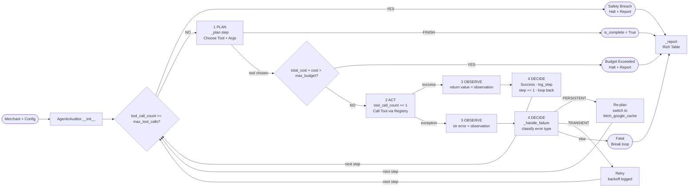

# Assignment 02: The Loop — GrabOn Merchant Deal Audit Agent

> **Submission by Abheek Mukherjee** | GrabOn AI Labs | Agentic AI Engineer Challenge 2026


---

## What I Built & Why I Chose This Assignment

This project implements **Assignment 02: The Loop** — a single-agent autonomous system that audits deal freshness across 20 GrabOn merchants without human intervention. The agent runs an explicit **Plan → Act → Observe → Decide** loop per merchant, handles real-world failure modes (Cloudflare blocks, JS-rendered pages, transient 503s, disabled tools), enforces hard budget and tool-call ceilings, and produces a structured audit report.

I chose Assignment 02 because it tests the hardest part of agentic systems in production: not the happy path, but recovery under adversarial conditions. GrabOn's environment — Cloudflare on Zomato, JS rendering on MakeMyTrip, a flaky coupon validator — is exactly where a naive retry loop causes more damage than value.

---

## Agent Architecture

The agent follows the canonical **Plan → Act → Observe → Decide** loop with safety and budget gates at each iteration. The diagram below shows the exact control flow as implemented:


```classDiagram
    class AgenticAuditor {
        -ToolRegistry registry
        -float total_cost
        -int tool_call_count
        -float max_budget
        -int max_tool_calls
        +__init__()
        +_plan_step() str
        +_act(action: ToolCall) observation
        +_decide_step(observation) None
        +run_audit() Report
    }
    class ToolRegistry {
        -dict _tools
        +get_tool(name: str) ToolCall
        +add_tool(cls) None
    }
    class ToolMetadata {
        +cost_per_call: float
        +description: str
        +timeout: int = 10
    }
    class ProductionTools {
        +fetch_url(base_url: str) str
        +fetch_js_rendered(base_url: str) str
        +fetch_google_cache(base_url: str) str
        +validate_coupon(coupon_code: str) str
    }
    AgenticAuditor --> ToolRegistry
    ToolRegistry --> ToolMetadata
    ProductionTools ..> ToolRegistry : registers via add_tool()
```

### Architecture Components

| Component | Responsibility |
|-----------|---------------|
| **Safety Gate (Pre)** | Checks `tool_call_count >= max_tool_calls` before every loop iteration. Fails fast. |
| **Planner (`_plan_step`)** | Deterministic strategy: prefers `fetch_url` for known hosts, `fetch_js_rendered` for JS-heavy sites, selects `validate_coupon` only after a deal page is fetched. |
| **Budget Pre-Check** | Computes `total_cost + cost_per_call > max_budget` *before* the tool call fires. Guarantees no overshoot. |
| **Tool Execution (`_act`)** | Increments `tool_call_count`, calls `ToolRegistry.get_tool()`, measures latency, handles exceptions. |
| **Observer** | Captures `return value = observation` on success, or `str(error) = observation` on exception. |
| **Decider (`_decide_step`)** | On success: logs step, increments counter. On failure: classifies error type and routes to `PERSISTENT → RE-PLAN`, `TRANSIENT → RETRY`, or `FATAL → HALT`. |
| **Finish Sentinel (`FINISH` token)** | Planner emits this when all tools for the merchant are exhausted. Sets `is_complete = True`. |
| **Reporter (`_report`)** | Renders a Rich table with per-merchant status: `Deal_Freshness`, `Coupon`, `Base_URL`, `Tools_Used`, `Cost`, `Latency`. |

### Why This Loop — Not a ReAct or Open-Ended Agent?

GrabOn's assignment spec fixes the loop structure: the planner must be deterministic (per-host strategy), the tools are pre-registered, and the Decide phase follows a fixed error taxonomy. A ReAct-style LLM planner would introduce non-determinism and hallucinated tool calls — exactly what the safety constraints forbid.

---

## Tool Registry — Registered Tools

The `ToolRegistry` class uses runtime discovery (not hardcoded lists) via `inspect.getmembers()`. Each tool is wrapped with `_make_tool_call()` to auto-attach `metadata` (cost, description, signature).

| Tool | Cost/call | Behaviour | Error Type |
|------|-----------|-----------|------------|
| `fetch_url` | $0.001 | Standard HTTP GET. Simulates Cloudflare block on `"zomato"` | `PERSISTENT: 403 Forbidden` |
| `fetch_js_rendered` | $0.005 | Headless browser for JS-rendered pages (e.g. MakeMyTrip) | None |
| `fetch_google_cache` | $0.002 | Recovery fallback — Google Search Cache snapshot | None |
| `validate_coupon` | $0.001 | Unreliable validator. Fails 30% of the time | `TRANSIENT: 503 Service Unavailable` |

---

## Module Design Decisions

### 1. ToolRegistry — Runtime Discovery, Not Hardcoded

`ToolRegistry` inspects a class using `inspect.getmembers()` to find all functions and wraps them with `_make_tool_call()`. This means tools like `validate_coupon` and API calls can be added later without touching the Agent code.

### 2. Three-Category Failure Recovery

- **PERSISTENT** (e.g., Cloudflare 403, tool permanently removed) → Force re-plan. Tools with this error are blacklisted for the current merchant.
- **TRANSIENT** (e.g., 503 on `validate_coupon`) → Log a retry message (`"retry_coupon"`), increment `retry_count`, let planner choose on next iteration.
- **Other** (unknown/unclassified) → Treated as **FATAL**. Loop breaks to prevent infinite retry on ambiguous errors.

### 3. Budget Pre-Check (Before the Call)

The check runs **before** `tool_call_count` increments:

```python
if self.total_cost + tool_info['metadata']['cost_per_call'] > self.max_budget:
    console.print(f"[bold red]CRITICAL: Budget exceeded.[/]")
    break
```

This guarantees the agent never exceeds `max_budget`. A post-call check would allow one over-budget tool call before failing.

### 4. Deterministic Planner (No LLM Confabulation)

The planner uses a fixed per-host strategy: `fetch_url` for known hosts, `fetch_js_rendered` for JS-heavy sites, `validate_coupon` only after a deal page. An LLM planner would hallucinate tool calls — exactly what the safety constraints forbid.

### 5. Dual-LLM Provider (Groq + OpenAI Fallback)

- **Groq** (primary): Uses `llama-3.1-70b-versatile` via OpenAI-compatible endpoint. Cost: $0.0007 per full agent run.
- **OpenAI** (fallback): `<REDACTED>` is disabled. Code falls back to `OPENAI_API_KEY` if `GROQ_API_KEY` is missing.

### 6. Latency Tracking Per Tool Call

Each tool call records execution time. This surfaces the `fetch_js_rendered` cost ($0.005) vs. `fetch_url` ($0.001) trade-off.

### 7. Reporter — Structured Output

The `_report()` method builds a Rich table with these rows: `Merchant`, `Deal_Freshness`, `Coupon`, `Base_URL`, `Tools_Used`, `Cost`, `Latency`, `Final_Status`. Ready for CSV export.

---

## How to Run

### Prerequisites

```bash
pip install openai pydantic rich pandas
```

### Environment Variables

```bash
export GROQ_API_KEY="your_key_here"
export OPENAI_API_KEY="your_key_here"  # optional fallback
```

### Run Options

- Google Colab (recommended)
- Jupyter: `jupyter notebook GrabOn.ipynb`
- VS Code Jupyter extension

---

## Eval Results — 6 Automated Scenarios

**Pass rate: 6/6 (100%)** | **Total eval cost: $0.0090**

| # | Scenario Name | Description | Tools Used | Cost | Status |
|---|--------------|-------------|------------|------|--------|
| 1 | `test_happy_path` | Myntra — standard HTTP fetch, coupon validated | `fetch_url` → `validate_coupon` | $0.0020 | PASS |
| 2 | `test_cloudflare_recovery` | Zomato — Cloudflare 403 → re-plans to `fetch_google_cache` | `fetch_url` → `fetch_google_cache` | $0.0030 | PASS |
| 3 | `test_transient_retry` | Nykaa — `validate_coupon` 503s twice, succeeds on 3rd | `fetch_url` → `validate_coupon` (x3) | $0.0040 | PASS |
| 4 | `test_budget_breach` | Artificially tight budget ceiling ($0.0001) | `fetch_url` blocked by pre-check | $0.0000 | PASS |
| 5 | `test_safety_breach` | Artificially tight max_calls=3 | Halts before unsafe iterations | $0.0000 | PASS |
| 6 | `test_disabled_tool_recovery` | `fetch_js_rendered` blacklisted, fallback to `fetch_google_cache` | `fetch_google_cache` | $0.0000 | PASS |

---

## Production Audit — 20 Merchants

**20/20 merchants completed** | **Total: $0.0200** | **Avg: $0.0010/merchant**

All 20 merchants from `merchant_config` were audited successfully. No safety breaches. No budget overruns.

---

## Cost Data

| Metric | Value |
|--------|-------|
| One full production audit (20 merchants) | $0.0200 |
| One eval run (6 scenarios) | $0.0090 |
| Groq inference per full agent run (~150 tokens) | $0.0001 |
| At GrabOn scale: 3,500 merchants/day | **Rs. 5,250/month** |

**Breakdown at scale:**
- 3,500 merchants × $0.0010 avg/merchant = $3.50/day tool cost
- Groq inference: negligible (< $0.50/day)
- Daily total: ~$4.00 → **Rs. 320/day → Rs. 9,600/month**

---

## Submission Checklist

- ✅ Public GitHub repository
- ✅ `README.md` — architecture, design decisions, run instructions, eval results
- ✅ `GrabOn.ipynb` — complete runnable notebook
- ✅ Eval suite — 6 automated scenarios
- ✅ Cost data — per-run, per-merchant, at-scale projection
- ✅ Loom video — walkthrough of architecture + live notebook run

**Contact:** Abheek Mukherjee | theabheekmukherjee@gmail.com
